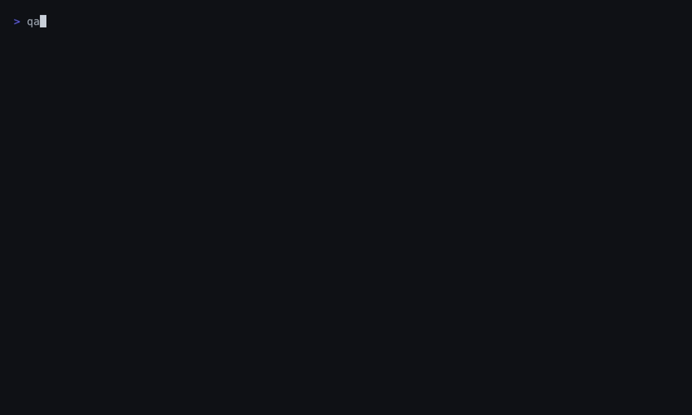

# QAMap

[](https://github.com/IvoryCanvas/qamap/actions/workflows/ci.yml)
[](https://www.npmjs.com/package/@ivorycanvas/qamap)
[](LICENSE)

**A local-first QA skill for AI-generated PRs. QAMap turns a PR diff into affected flows, missing evidence, and E2E drafts. No cloud. No LLM token.**

QAMap reads git changes, project structure, runner signals, selectors, and optional repo QA memory, then answers the question every reviewer asks: *"This PR looks plausible — which user flow could it break, and what should we verify before merge?"* It focuses on the judgment step ("what deserves testing"), not on competing with LLMs at writing test code.

```txt
PR diff
  -> qamap qa
  -> affected flows + missing evidence + PR checklist + E2E starter draft

Optional team memory (.qamap/manifest.yaml)
  -> sharper recommendations on every future PR
```

## 30-Second Demo



A real, unedited recording on a Next.js app with **zero committed tests**: `qamap qa` names the affected flow, `qamap e2e setup` writes the Playwright config and a starter spec, and `npm run test:e2e` finishes with `1 passed`. First-run assertions are smoke checks — the point is a runnable starting point, not finished coverage.

Every report now opens with the verdict (trimmed real output):

```txt
## At a Glance

- Affected: Orders Submit, Orders API contract smoke flow
- Do next: `qamap e2e setup . --runner playwright`
- Blocking 1: Configure Playwright execution — create playwright.config.ts (...)
```

## Install & Quick Start

Requires Node.js 20 or newer. Inside a repository whose default branch is `origin/main` (or `main`), the base is inferred automatically:

```sh
pnpm dlx @ivorycanvas/qamap qa            # what should this branch prove before merge?
pnpm dlx @ivorycanvas/qamap e2e setup . --runner playwright   # no tests yet? create config + starter spec
pnpm dlx @ivorycanvas/qamap manifest init # optional: save reviewed team QA memory for sharper future runs
```

Pass `--base <ref> --head <ref>` for anything non-standard. Run bare `qamap` for a start-here guide, `qamap help` for the full reference, and see the [command reference](docs/commands.md) for every command and output shape.

## For Coding Agents

Stop re-explaining the same QA context to your agent on every PR:

```sh
qamap qa --format agent
```

One minified JSON object (`schema: qamap.qa`, ~2 KB for a small PR) with affected flows, draft paths, required evidence, and the PR checklist — the decision content of the full report at a fraction of the context cost. A portable skill template ships in the package ([skills/qamap-pr-qa/SKILL.md](skills/qamap-pr-qa/SKILL.md)), and `qamap context --write AGENTS.md` teaches agents in a repo to run QAMap themselves. Details: [agent skill guide](docs/agent-skill.md).

## Why QAMap

- **Judgment first, generation second.** LLMs write test code well; deciding *what deserves testing* for a given diff is the missing layer. QAMap fills it statically, deterministically, for free.
- **The repo remembers.** Team QA knowledge lives in `.qamap/manifest.yaml`, reviewed once and reused on every PR — instead of re-prompting an agent each session.
- **Honest output.** Drafts state what blocks them from being trusted; changed endpoints are observed, never mocked away; generated specs never assert what cannot pass.

Positioning against recorders, LLM test generation, and impact-analysis tools: [where QAMap fits](docs/adoption.md#where-qamap-fits).

<details>
<summary>한국어 소개</summary>

QAMap는 AI 코딩 에이전트가 만든 PR을 리뷰하기 전에 로컬에서 실행하는 QA 초안 CLI입니다.

PR diff와 repo 구조를 읽고 어떤 사용자 플로우가 영향받았는지, 어떤 E2E 또는 체크리스트가 필요한지, fixture/selector/assertion/runner/validation 근거 중 무엇이 부족한지 정리합니다. 클라우드나 LLM 토큰을 쓰지 않습니다.

```sh
pnpm dlx @ivorycanvas/qamap qa . --base origin/main --head HEAD
```

에이전트에게 넘길 때는 `--format agent`를 붙이면 같은 판단 내용을 약 2KB의 JSON으로 받을 수 있어, 매 세션 repo 탐색에 토큰을 쓰지 않아도 됩니다.

목표는 거대한 QA 플랫폼이 아니라, 유지보수자가 매번 에이전트에게 프로젝트 맥락과 검증 방법을 다시 설명하느라 쓰는 시간을 줄여주는 작고 선명한 도구입니다. Manifest 없이 바로 시작하고, 반복해서 틀리는 추천은 `.qamap/manifest.yaml`에 팀의 QA 언어로 보정해 향후 PR 추천을 개선합니다.

</details>

## Documentation

| Guide | What it covers |
| --- | --- |
| [Command reference](docs/commands.md) | Every command, outputs, and the E2E draft pipeline in depth |
| [Quick start walkthrough](docs/quickstart-demo.md) | The 30-second demo, step by step |
| [Verification manifest](docs/manifest.md) | Repo-local QA memory: schema, init, explain, repair loop |
| [Adoption & rollout](docs/adoption.md) | First run to CI gate, plus positioning |
| [Agent skill guide](docs/agent-skill.md) | Using QAMap from coding-agent workflows |
| [Repository guardrails](docs/guardrails.md) | The optional static scanner and its rules |
| [Configuration](docs/configuration.md) | `qamap.config.json` policy options |
| [GitHub Action](docs/github-action.md) | PR annotations, summaries, and comments in CI |
| [Benchmarking](docs/benchmarking.md) | Scoring output quality against pinned repositories |
| [Roadmap](docs/roadmap.md) | Where this is going |

## Project Status

QAMap is early and pre-`1.0`; the public API may change. Issues and pull requests are welcome — see [CONTRIBUTING.md](CONTRIBUTING.md). QAMap does not replace review, tests, or security tooling; it removes the blank-page work that makes teams skip good verification.
